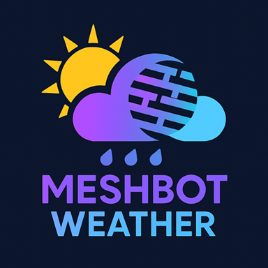
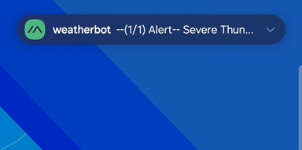
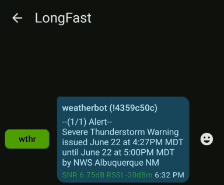
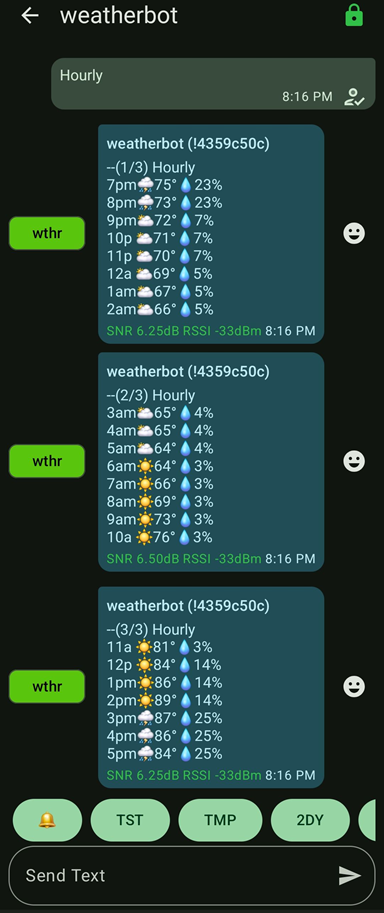
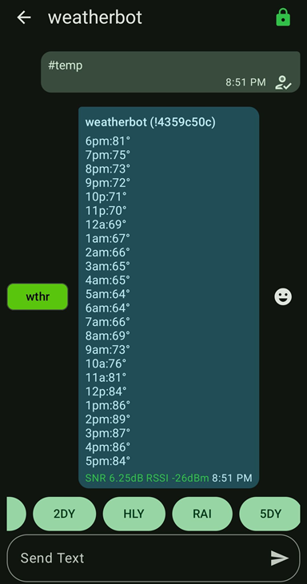
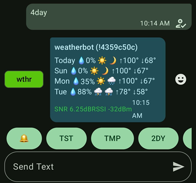
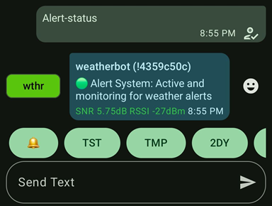
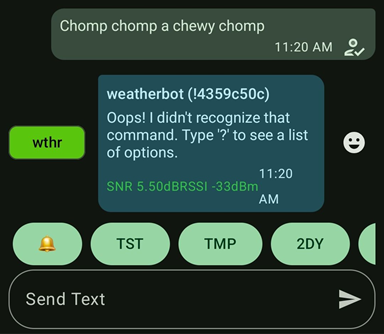
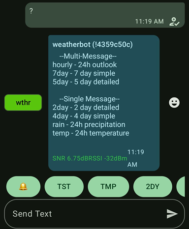
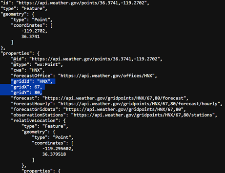

# MeshBot Weather




























MeshBot Weather is a spinoff of [MeshBot](https://github.com/868meshbot/meshbot) with a detailed focus on weather. Designed to run on a computer or a 
Raspberry Pi with a connected Meshtastic device. 

Our Mission: 

 - To provide accurate weather forecast via the mesh.
 - To provide weather alerts anywhere, including locations that don't receive NOAA radio broadcast.
 - To allow simple customization of different parameters to better suit your deployment.
 - To be lightweight, if the computer can run Python, it can run MeshBot Weather
 - To be opensource an open community, modify at will. Please publish and share your meshtastic work.

## Features

- Utilizes the National Weather Service, the official source for NOAA-issued EAS alerts.
- Automatically sends severe weather alerts to all devices on the mesh network.
- Weather forcast: A selection of Multi-day and hourly forcast available on demand.
- Easily accesible menu that can be called by sending "?" to the bot.
- Help message reply when the bot receives an unrecognized instruction.
- Alert system test command to varify the weather alert api is responding and is configured correctly.
- Detailed multi-message outputs for deployments on private and low-traffic meshes.
- Includes a variety of single message options for use on meshes that are high traffic / high utilization.
- Ability to enforce single message use by disabling multi-message outputs via the settings.yaml file. 
- Configurable node daily reboot function. Useful if your current firmware is a little less than stable.
- Forcast are generated for any location. Not limited to towns or cities.

## Bot interaction

You bot will be accessible through the meshtastic mesh network through the node name. DM the bot/node and issue any of the following commands:

- ? : receive a message with a menu of all weather commands.
- hourly : 24 hour hourly forcast with temp, rain chance, and sky conditions in emoji form. (Multi message return)
- 5day : 5 day detailed forcast (Multi message return)
- 7day : 7 day forcast in emoji form (Multi message return)
- 4day : 4 day simple forcast in emoji form (Single message return)
- 2day : Today and tomorrows detailed forcast (Single message return)
- rain : Rain chance every hour for next 24 hours (Single message return)
- temp : Predicted temperature every hour for the next 24 hours (Single message return)


Commands below are not listed in the help menu:
- alert-status : Runs a check on the alert system. Returns ok if good or error code if an issue is found.
- test : bot will return an acknowledgement of message received.
- tst-detail : as #test above only more detail e.g snr,rssi, hop count (thanks to [rohanki](https://github.com/rohanki))
- advertise : When received the bot will send out a message on the public channel introducing itself along with its menu
command.

## Requirements

- [Python](https://www.python.org/) 3.11 or above 
- Access to a [Meshtastic](https://meshtastic.org) device 
- [Serial Drivers](https://meshtastic.org/docs/getting-started/serial-drivers/) for your meshtastic device
- Internet connection for the bot.

## Meshbot Weather Installation

1. Open your terminal, then clone this repository to your local machine:

```
git clone https://github.com/oasis6212/meshbot_weather.git
```

2. Navigate into the folder 

```
cd meshbot_weather
```

3. Setup a virtual environment

```
python3 -m venv .venv
```
4. Activate virtual environment

```
. .venv/bin/activate
```

5. Install the required dependencies using pip:

```
pip install -r requirements.txt
```
6. Connect your Meshtastic device to your computer via USB


## How to run the program on various operating systems:


Example on Linux:

```
python meshbot.py --port /dev/ttyUSB0
```

Example on OSX:

```
python meshbot.py --port /dev/cu.usbserial-0001
```

Example on Windows:

```
python meshbot.py --port COM7
```

Example using TCP client:

```
python meshbot.py --host meshtastic.local
or
python meshbot.py --host 192.168.0.100
```
For a list of avaiable ports:
```
python meshbot.py --help
```
## Configuration

The ''settings.yaml'' file; it's where you can configure different options. Can be edited in notepad.

Example Content:

```
MYNODES:
  - "3663493700"
  - "1234567890"
DM_MODE: true
FIREWALL: false
DUTYCYCLE: false
NWS_OFFICE: "LOX" 
NWS_GRID_X: "155"
NWS_GRID_Y: "45"
USER_AGENT_APP: "myweatherapp" 
USER_AGENT_EMAIL: "contact@example.com" 
ALERT_LAT: "34.0522" 
ALERT_LON: "-118.2433"
ALERT_CHECK_INTERVAL: 300  
MESSAGE_DELAY: 15  
ALERT_INCLUDE_DESCRIPTION: false 
ENABLE_7DAY_FORECAST: true  
ENABLE_5DAY_FORECAST:  true  
ENABLE_HOURLY_WEATHER: true 
FULL_MENU: true
ENABLE_AUTO_REBOOT: false  
AUTO_REBOOT_HOUR: 3  
AUTO_REBOOT_MINUTE: 0  
REBOOT_DELAY_SECONDS: 10  

```

Description

- MYNODES = A list of nodes (in int/number form) that are permitted to interact with the bot


- DM_MODE = true: Only respond to DMs; false: responds to all traffic (recommend keeping this set to true)


- FIREWALL = false: if true only responds to MYNODES


- DUTYCYCLE: false: If true, limits itself to 10% Dutycycle


- NWS_OFFICE: NWS_GRID_X: NWS_GRID_Y: #settings for the weather forcast api calls, see below to learn how to set up.


- USER_AGENT_APP: "myweatherapp" #used for NWS (National Weather Service) API calls, can be whatever you want, more 
unique the better. This is what NWS uses instead of an API key.


- USER_AGENT_EMAIL: "contact@example.com" #your email, in the event NWS detects excess api calls they will throttle you.
Gives you the opportunity to fix the issue and stop getting throttled.

 
- ALERT_LAT: "34.0522" ALERT_LON: "-118.2433" #settings for alerts, put in the latitude, and longitude of the area you 
want alerts for. Make sure you only go up to 4 places past the decimal point on each.


- ALERT_CHECK_INTERVAL: # Time in seconds. How often the alert API is called. NWS does not publish allowable limits. 
From what I have gathered, they allow up to once a minute for alert checking. Your milage may very. 


- MESSAGE_DELAY: Delay in seconds between split messages. To short of a delay can cause messages to arrive out of order.


- ALERT_INCLUDE_DESCRIPTION: #Set to false to exclude description from alerts. Descriptions will include alot of detail 
such as every county, town, and area affected. You can expect about 4 or 5 messages when description is set to "true" vs
a single message when set to false. 


- ENABLE_7DAY_FORECAST: ENABLE_5DAY_FORECAST: ENABLE_HOURLY_WEATHER: # These calls produce 2 to 4 messages each. If you
are on a high-traffic mesh, you may want to disable these.


- FULL_MENU: false  # When true, includes all weather commands. When false, shows only forecast options that return a 
single message.


- ENABLE_AUTO_REBOOT: false  # Some firmware versions may experience Wi-Fi instability after the node has been running 
for several days. If you encounter this issue, consider enabling the auto-reboot function by setting this to "true".


- AUTO_REBOOT_HOUR: 3  # Hour for daily reboot (24-hour format)


- AUTO_REBOOT_MINUTE: 0  # Minute for daily reboot. 


- REBOOT_DELAY_SECONDS: 10  # This delay is executed on the node itself to give it time to prepare. Recommend not 
changing this.


## How to get your NWS_OFFICE, NWS_GRID_X, and NWS_GRID_Y
To get your NWS office and grid coordinates:
1. Go to (https://weather.gov)
2. Enter your address
3. The URL will change to something like: `https://forecast.weather.gov/MapClick.php?lat=XX.XXXX&lon=YY.YYYY`
4. Visit (https://api.weather.gov/points/XX.XXXX,YY.YYYY) (using your coordinates)  

Example: https://api.weather.gov/points/36.3741,-119.2702 
(If you know them, you can replace the coordinates in this link here with yours and skip the first part. Don't enter 
more than 4 digits past the decimal point in your latitude and longitude numbers.)

5. Look for the `gridId` (NWS_OFFICE) and `gridX` (NWS_GRID_X),`gridY` (NWS_GRID_Y) values in the response. You will 
have to scroll down the page some.




Enter this info into the yaml file.

For the alert settings in the yaml file, enter your gps coordinates or use the coordinates you retrieved earlier in this 
process. Use no more than four digits after the decimal point.


## API Handaling details

To prevent excessive api calls, the bot will check if it currently has the data being requested and if it is
less than an hour old. If both those conditions are met, the bot will use its catched data. If not, it will refresh the
weather info. It will not produce more than two api calls per hour for weather forcast. One for hourly data and the 
other for daily data. If there are no mesh side weather requests, then no api calls are made.

Alerts are refreshed every five minutes by default. This is configurable via the "settings.yaml" file. Due to the nature
of the data being requested, this is considered acceptable. The NWS does not post its api call limits, but will throttle
you if they deem it excessive. What I've gathered from home automation groups is you can make the alert api call up to 
every minute without issue. 

You should set these options in your settings.yaml file

USER_AGENT_APP: "myweatherapp"

USER_AGENT_EMAIL: "contact@example.com"

Most weather api's use a key to identify your specific instance. Instead, the NWS uses this to identify you. It's more 
convenient because you don't have to actually sign up for anything, and instead just use unique info instead. 

The bot will work with the defaults here, but if you run it with these, your api calls will be added up along with 
everyone else running the defaults. This could cause your API request to be throttled.  


## Contributors

- [868meshbot](https://github.com/868meshbot), [oasis6212](https://github.com/oasis6212)

## Acknowledgements

This project utilizes the Meshtastic Python library, which provides communication capabilities for Meshtastic devices. 
For more information about Meshtastic, visit [meshtastic.org](https://meshtastic.org/).

## License

This project is licensed under the MIT License - see the [LICENSE](LICENSE) file for details.

## Legal
This project is neither endorsed by nor supported by Meshtastic.

Meshtastic® is a registered trademark of Meshtastic LLC. Meshtastic software components are released under various 
licenses, see GitHub for details. No warranty is provided - use at your own risk.